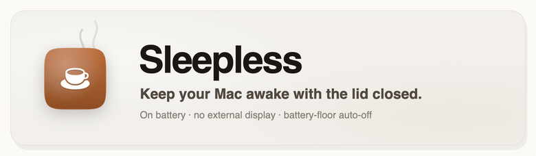
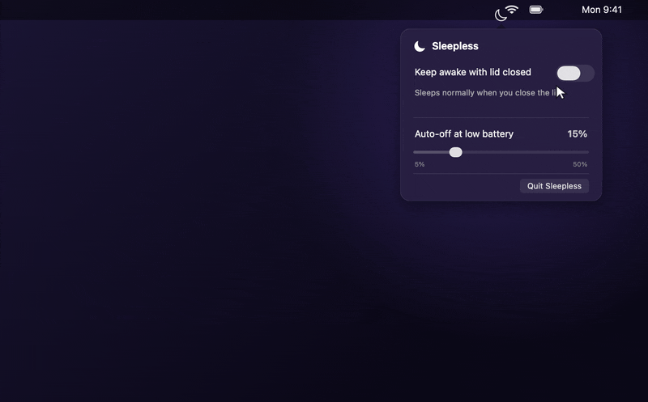

<!-- Language switcher. Keep this row identical across every README.<lang>.md. -->
<p align="center">
  <b>English</b> &nbsp;·&nbsp;
  <a href="README.zh-CN.md">简体中文</a> &nbsp;·&nbsp;
  <a href="README.es.md">Español</a> &nbsp;·&nbsp;
  <a href="README.ja.md">日本語</a> &nbsp;·&nbsp;
  <a href="README.fr.md">Français</a> &nbsp;·&nbsp;
  <a href="README.de.md">Deutsch</a>
</p>

<p align="center">
  <picture>
    <source media="(prefers-color-scheme: dark)" srcset="assets/hero-dark.gif">
    <source media="(prefers-color-scheme: light)" srcset="assets/hero-light.gif">
    
  </picture>
</p>

<p align="center">
  <b>Keep your MacBook awake with the lid closed, on battery, with no external display.</b><br>
  <sub>One menu-bar switch, with an auto-off timer and a battery-floor cutoff so you never drain it flat.</sub>
</p>

<p align="center">
  <a href="https://github.com/Aboudjem/Sleepless/actions/workflows/ci.yml"></a>
  <a href="https://github.com/Aboudjem/Sleepless/releases/latest"></a>
  <a href="https://github.com/Aboudjem/Sleepless/releases"></a>
  <a href="https://github.com/Aboudjem/Sleepless/stargazers"></a>
  <a href="LICENSE"></a>
  
</p>
<p align="center">
  
  
  
  <a href="https://github.com/Aboudjem/homebrew-tap"></a>
</p>

<p align="center">
  
</p>

> [!NOTE]
> A closed lid sleeps your Mac, and `caffeinate` apps (KeepingYouAwake and friends) can't change that, by design. Sleepless flips the one setting that can, `pmset disablesleep`, with safety nets so it is safe to forget.

## Install

```sh
brew install --cask aboudjem/tap/sleepless
/Applications/Sleepless.app/Contents/Resources/grant.sh   # one-time passwordless grant
```

| Other ways            |                                                                                                                                                                                                              |
| --------------------- | ------------------------------------------------------------------------------------------------------------------------------------------------------------------------------------------------------------ |
| **Download**          | Grab the [latest release](https://github.com/Aboudjem/Sleepless/releases/latest), unzip to `/Applications`, then approve it in **System Settings → Privacy & Security → Open Anyway** (it is ad-hoc signed). |
| **Build from source** | `git clone https://github.com/Aboudjem/Sleepless.git && cd Sleepless && ./install.sh` (no Gatekeeper prompt).                                                                                                |

Then click Sleepless in the menu bar, flip the switch, and close the lid.

## Features

|     |                          |                                                                                                  |
| --- | ------------------------ | ------------------------------------------------------------------------------------------------ |
| ☕  | **One switch**           | Click the menu-bar cup, flip the toggle.                                                         |
| ⏲️  | **Auto-off timer**       | 1h or 2h with a live countdown, then off.                                                        |
| 🔋  | **Battery floor**        | Auto-off at 5–50% on battery (default 15%).                                                      |
| 🤖  | **Agent-aware auto-off** | Watches local Claude Code, Codex, and Cursor signals, then turns off when no agents are running. |
| 📡  | **No-internet auto-off** | Turns off after sustained public-internet reachability loss.                                     |
| 🪫  | **Low Power Mode**       | Steps aside when LPM is on, on battery.                                                          |
| 🖥️  | **No dongle**            | Lid closed, on battery. No monitor, no HDMI plug.                                                |
| 🚀  | **Launch at login**      | Optional, off by default, always starts idle.                                                    |
| 🪶  | **Tiny + native**        | Small AppKit app. No Dock icon, daemon, kext, UI scraping, or Screen Recording.                  |

**Menu-bar glyph:** empty cup = off · full cup = awake · full cup + dot = awake on battery (auto-off live).

## Sleepless vs the alternatives

|                               | **Sleepless** | Amphetamine  | KeepingYouAwake | `caffeinate` |
| ----------------------------- | :------------------: | :----------: | :-------------: | :----------: |
| Awake, lid closed, no monitor |         ✅ ¹         |     ⚠️ ²     |      ❌ ³       |      ❌      |
| On battery                    |          ✅          |      ✅      |   ✅ lid open   |     ⚠️ ⁴     |
| Auto-off timer                |          ✅          |      ✅      |       ✅        |      ❌      |
| Auto-off on low battery       |          ✅          |      ✅      |       ✅        |      ❌      |
| Open source                   |        ✅ MIT        | ❌ App Store |     ✅ MIT      |    Apple     |
| Cost                          |         Free         |     Free     |      Free       |     Free     |

<sub>As of 2026-06. ¹ Uses `pmset disablesleep` and reads the flag back; behavior is hardware/macOS-version dependent. ² Documents closed-display mode but is widely reported to fail on Apple Silicon on power-source changes ([AE #28](https://github.com/x74353/Amphetamine-Enhancer/issues/28)); the app is closed source. ³ Can't do lid-closed by design, it wraps `caffeinate` ([#66](https://github.com/newmarcel/KeepingYouAwake/issues/66)). ⁴ `caffeinate -i` runs on battery; `-s` is AC-only.</sub>

## Use it to

- 🤖 Finish overnight jobs lid-closed: agent runs, builds, renders, ML training.
- 📡 Share a hotspot from your bag.
- ⬇️ Leave big downloads, uploads, or backups running.
- 🖥️ Keep a local server or SSH session reachable.

> [!TIP]
> Set a battery floor you trust (say 20%) plus a timer, and you can walk away without babysitting the battery.

## How it works

Sleepless toggles `pmset disablesleep` (the kernel's `SleepDisabled` flag), reads it back so the menu bar never lies, and reverts it at your battery floor, in Low Power Mode, when the timer ends, when an enabled agent/internet cutoff fires, or on reboot. A GUI app can't type a password, so the installer adds a scoped sudoers rule for **exactly two commands**:

```
#<your-uid> ALL=(root) NOPASSWD: /usr/bin/pmset -a disablesleep 0, /usr/bin/pmset -a disablesleep 1
```

- **Can't be widened.** sudoers matches arguments literally, no wildcards.
- **Nothing privileged to hijack.** No daemon and no privileged helper script. The ongoing keep-awake toggle calls `/usr/bin/pmset` directly with an argv array.
- **Always reversible.** Reboot, the floor, the timer, or `./uninstall.sh` (which proves the grant is gone).

Agent monitoring is local-only: bounded CLI/app detection, user-owned processes, and optional heartbeat hooks for tools that need stronger signals. Sleepless does not scrape app windows, request Screen Recording, or monitor vendor cloud agents with no local signal. Internet auto-off uses macOS network path status plus a lightweight HTTPS reachability probe, and both new cutoffs default off until you enable them.

Verify a download, no Apple account needed:

```sh
shasum -a 256 -c SHA256SUMS
gh attestation verify Sleepless-*.zip -R Aboudjem/Sleepless
```

Full threat model, the App Store verdict, and the audit guide: [SECURITY.md](SECURITY.md) · [docs/AUDIT.md](docs/AUDIT.md).

## FAQ

<details>
<summary><b>Does <code>pmset disablesleep</code> still work on Apple Silicon (M1/M2/M3)?</b></summary>

Yes. `pmset -a disablesleep 1` sets the kernel's `SleepDisabled` flag on Apple Silicon, confirmed firsthand on macOS 26.3, which keeps the Mac awake with the lid closed on battery. Verify with `pmset -g | grep SleepDisabled` (it should read `1`). Claims that it "stopped working" usually describe `caffeinate` or caffeinate-based apps, a different mechanism.

</details>

<details>
<summary><b>Why does my Mac sleep on lid close even with Amphetamine or KeepingYouAwake?</b></summary>

Those use macOS power assertions, which stop the idle timer but can't override the hardware lid-close trigger. KeepingYouAwake wraps `caffeinate`, which can't do lid-closed ([#66](https://github.com/newmarcel/KeepingYouAwake/issues/66)). `pmset disablesleep`, which Sleepless uses, can.

</details>

<details>
<summary><b>Is it safe? Will it overheat or drain the battery?</b></summary>

It is safe for light unattended work (downloads, syncs, a hotspot). Heavy sustained load with the lid fully shut reduces airflow, so use judgement. The battery floor, Low Power Mode auto-off, and the timer all stop it before it drains the Mac.

</details>

<details>
<summary><b>Does it need sudo, a kernel extension, or a daemon?</b></summary>

One tightly scoped `sudo` grant (two exact `pmset` commands) so a GUI app can flip the setting without a prompt. No kernel extension, no daemon, and no privileged helper.

</details>

<details>
<summary><b>How do I stop it or remove it?</b></summary>

Flip the switch off, or let the timer or battery floor do it, and normal sleep returns. A reboot also resets it. `./uninstall.sh` removes the app, login item, and the sudoers grant, then proves the grant is gone.

</details>

<details>
<summary><b>Why isn't it notarized?</b></summary>

It is a personal open-source tool with no paid Apple Developer ID, so it is ad-hoc signed. Build from source to skip Gatekeeper, or use **Open Anyway** for the prebuilt app. The notarization steps are documented in [docs/AUDIT.md](docs/AUDIT.md).

</details>

## Contributing

Issues and PRs welcome, especially translations and reports from other hardware. See [CONTRIBUTING.md](CONTRIBUTING.md) and the [Code of Conduct](CODE_OF_CONDUCT.md). Sleepless stays deliberately small.

## License

[MIT](LICENSE) © 2026 Adam Boudjemaa.

<p align="center">
  <sub>If Sleepless saved you a trip to Terminal, a ⭐ helps other people find it.</sub>
</p>
